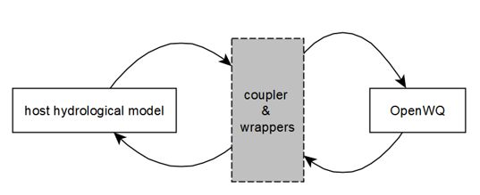

Overview
==================================

OpenWQ was specifically designed to promote flexible collaboration between modellers, scientists and stakeholders in the design and implementation of biogeochemical reaction networks (easily customizable via `rich JSON-based files <https://en.wikipedia.org/wiki/JSON#:~:text=JSON%20(JavaScript%20Object%20Notation%2C%20pronounced,(or%20other%20serializable%20values).>`_) in existing hydrological, hydrodynamic and groundwater models (1D to 3D models). The model is written in C++ and benefits from the powerful Armadillo template-based \CC library for linear algebra  `(Sanderson and Curtin, 2016) <https://joss.theoj.org/papers/10.21105/joss.00026>`_ that enables the use of modern, flexible, efficient and compact data structures.

The OpenWQ system stems from previous models developed by `Environment and Climate Change Canada <https://www.canada.ca/en/environment-climate-change.html>`_ and the `University of Saskatchewan <https://www.usask.ca/>`_, particularly `CRHM-WQ <https://www.sciencedirect.com/science/article/abs/pii/S0022169421009513>`_ (Cold Regions Hydrological Model - Water Quality) that extends the original `CRHM platform <https://onlinelibrary.wiley.com/doi/10.1002/hyp.6787>`_ (hydrology) model to nitrogen and phosphorus simulations, the `WINTRA <https://onlinelibrary.wiley.com/doi/10.1002/hyp.11346>`_ framework, the multiphase multilayer `PULSE <https://www.sciencedirect.com/science/article/abs/pii/S0309170818300095>`_ snow hydrochemistry model, and the `FLUXOS-OVERLAND <agupubs.onlinelibrary.wiley.com/doi/abs/10.1029/2020WR027984>`_ model for watershed hydrodynamic-water quality simulations suitable for Prairie regions.

Our vision is to provide a customizable, multi-scale, multi-chemistry modelling framework suitable for flexible model hypothesis testing and uncertainty analysis.
This is extremely important in a time of great climate uncertainty.

OpenWQ does not run standalone. It runs coupled to existing hydro-models, which makes it ideal for scientists and engineers that want to enable biogeochemical modelling capabilities in their preferred modelling systems. The model is currently being coupled to `CRHM <https://research-groups.usask.ca/hydrology/modelling/crhm.php>`_, `SUMMA <https://ral.ucar.edu/solutions/products/summa>`_ and `MESH <https://research-groups.usask.ca/hydrology/modelling/mesh.php>`_.
Explore the `Existing couplings <https://openwq.readthedocs.io/en/latest/5_3_0_Hydro_coupled_models.html>`_ section or learn how OpenWQ can be `coupled to your model <https://openwq.readthedocs.io/en/latest/5_3_Coupler_guide.html>`_.

`Contact us <https://openwq.readthedocs.io/en/latest/6_0_Contact.html>`_ if you're wondering if OpenWQ could be useful to your research.