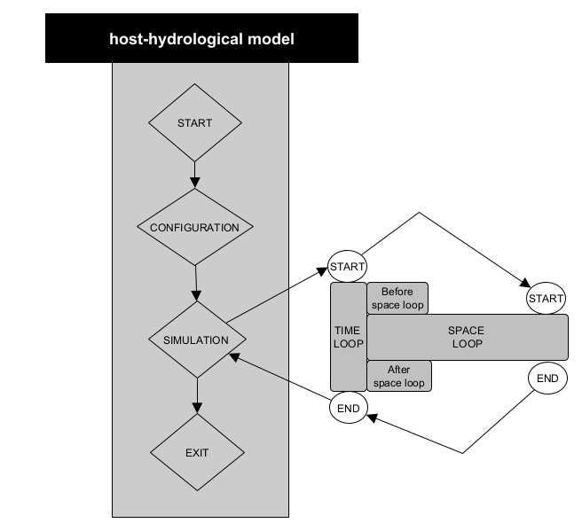
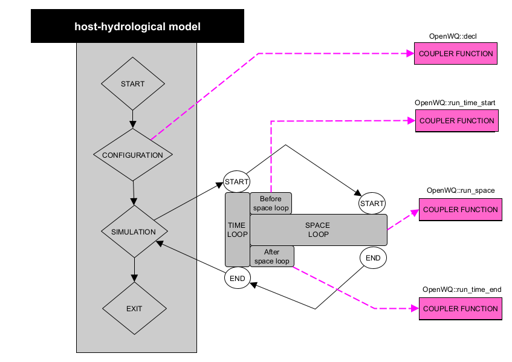
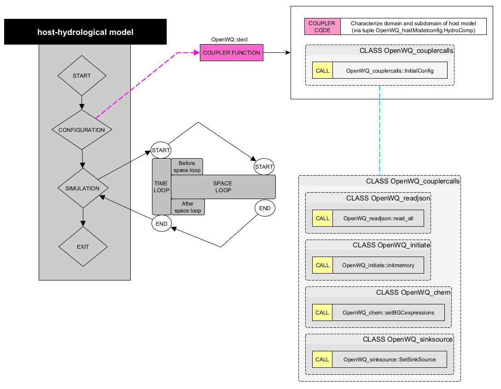
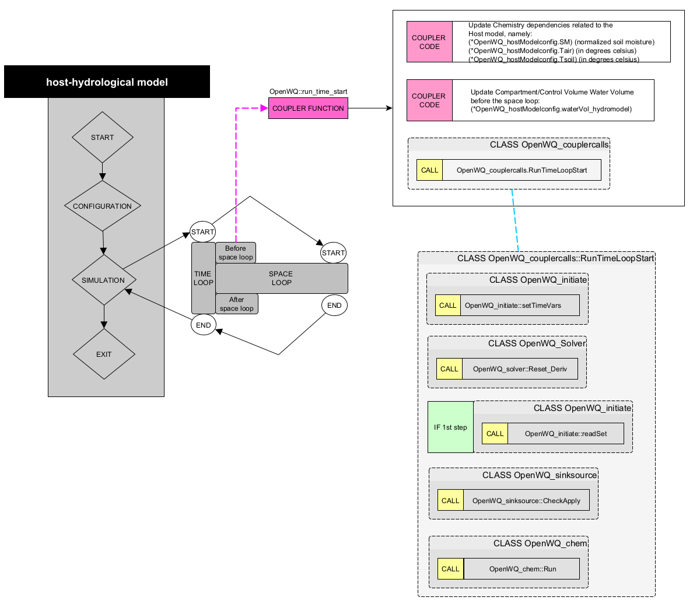
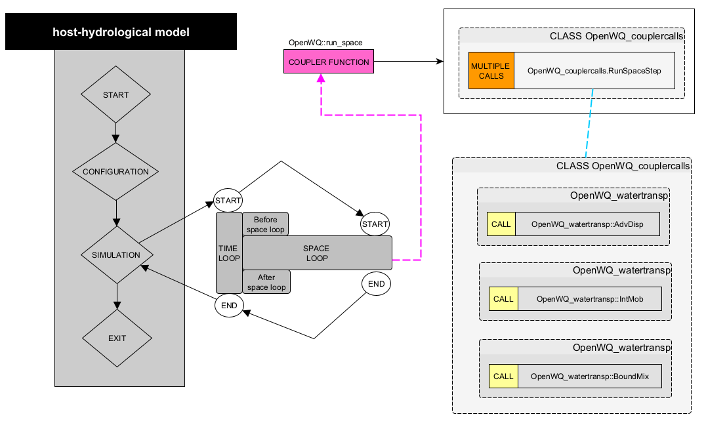
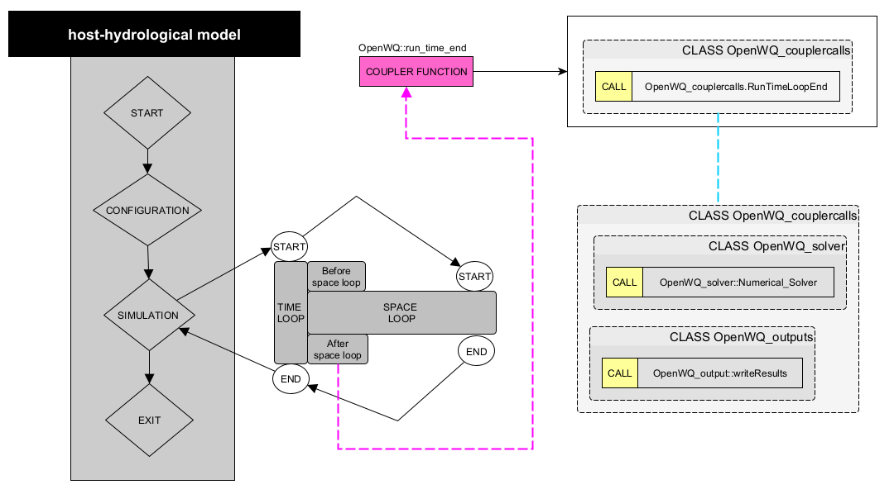

Steps to perform the coupling
==============================

To couple OpenWQ to an hydro-model, you need to call OpenWQ's coupler functions that contain a series of `API calls <https://openwq.readthedocs.io/en/latest/5_3_00_APIs.html>`_. The coupler functions provided are generic and were designed to require minimal editing, but each hydro-model is different so some adjustments are always needed. We refer to there adjustments as ``COUPLER CODE``.
This editable ``COUPLER CODE`` is to ensure that the data types used in the hydro-model are properly converted to OpenWQ's own data types, so that the `API calls <https://openwq.readthedocs.io/en/latest/5_3_00_APIs.html>`_ calls can perform adequately.
We suggest to place all the coupler calls inside the same file and name it ``OpenWQ_hydrolink.cpp``. It may be convenient to have an header file with the same name (``OpenWQ_hydrolink.h``).
Inside these ``hydrolink`` files, we also suggest that the couplers are placed inside a class with the name ``OpenWQ``. These suggestions are all optional and may not be relevant to your specific hydro-model.
However, all the steps described below, as well as the class names, consider these suggestions.

For now, don't worry with editing the ``COUPLER CODE``; it's the last step in the coupling process.

Bellow are all the steps you need to perform the coupling:

STEP 1: Hydro-model structure
~~~~~~~~~~~~~~~~~~~~~~~~~~~~~~~

Identify the following components of your hydro-model. It is important that you understand the source code of your model.

STEP 2: Create class objects
~~~~~~~~~~~~~~~~~~~~~~~~~~~~

Before you can call OpenWQ's coupler functions, you need to create OpenWQ class objects inside your hydro-model.
This can be accomplished by introducing the code below inside your hydro-model.

This code should be placed in a ``main`` function of your hydro-model from where the created objects objects can be passed to OpenWQ's coupler functions.
This is a critical step since these objects are input arguments of the different `OpenWQ's APIs <https://openwq.readthedocs.io/en/latest/5_3_00_APIs.html>`_ (passed by reference).

.. code-block:: guess

    // Include OpenWQ header files
    #include "<path>/OpenWQ_couplercalls.h"
    #include "<path>/OpenWQ_global.h"
    #include "<path>/OpenWQ_readjson.h"
    #include "<path>/OpenWQ_initiate.h"
    #include "<path>/OpenWQ_chem.h"
    #include "<path>/OpenWQ_watertransp.h"
    #include "<path>/OpenWQ_sinksource.h"
    #include "<path>/OpenWQ_units.h"
    #include "<path>/OpenWQ_solver.h"
    #include "<path>/OpenWQ_output.h"

    // Create OpenWQ Class Objects
    OpenWQ_couplercalls OpenWQ_couplercalls;        // Class that contains coupler functions
    OpenWQ_hostModelconfig OpenWQ_hostModelconfig;  // Class that stores hydro-model info
    OpenWQ_json OpenWQ_json;                        // Class that stores JSON input data
    OpenWQ_wqconfig OpenWQ_wqconfig('');            // Class that contains configuration functions
    OpenWQ_units OpenWQ_units;                      // Class that contains unit conversion functions
    OpenWQ_readjson OpenWQ_readjson;                // Class that contains functions to read and process JSON files
    int num_HydroComp = <number_of_compartments>;   // Set number of compartments/domains of the hydro-model
    OpenWQ_vars OpenWQ_vars(num_HydroComp);         // Class that stores global variables
    OpenWQ_initiate OpenWQ_initiate;                // Class tht contains pre-processing and initiation functions
    OpenWQ_watertransp OpenWQ_watertransp;          // Class that contains water transport functions
    OpenWQ_chem OpenWQ_chem;                        // Cass that contains biogeochemical functions
    OpenWQ_sinksource OpenWQ_sinksource;            // Cass that contains functions related to sinks and sources
    OpenWQ_solver OpenWQ_solver;                    // Class containing solvers
    OpenWQ_output OpenWQ_output;                    // Class containing printing functions

    // Include hydrolink header file
    #include "<path>/OpenWQ_hydrolink.h"

STEP 3: Locate coupler functions
~~~~~~~~~~~~~~~~~~~~~~~~~~~~~~~~~~~~~~~~~

Referring to the diagram in STEP 1, now you need to identify the main functions or code blocks of your hydro-model that are responsible for the tasks listed below.

    * [``CONFIGURATION``]
    * [``SIMULATION`` > ``TIME LOOP`` > ``Before space loop``]
    * [``SPACE LOOP``]
    * [``SIMULATION`` > ``TIME LOOP`` > ``After space loop``]

STEP 4: Call coupler functions
~~~~~~~~~~~~~~~~~~~~~~~~~~~~~~~~~~~~~~~

From each of those hydro-model functions or code blocks, call the following `OpenWQ coupler functions <https://openwq.readthedocs.io/en/latest/5_3_00_APIs.html>`_:
    * [``CONFIGURATION``]: call Coupler Function 1 (``OpenWQ::decl``)
    * [``SIMULATION`` > ``TIME LOOP`` > ``Before space loop``]: call Coupler Function 2 (``OpenWQ::run_time_start``)
    * [``SPACE LOOP``]: call Coupler Function 3 (``OpenWQ::run_space``)
    * [``SIMULATION`` > ``TIME LOOP`` > ``After space loop``]: Coupler Function 4 (``OpenWQ::run_time_end``)

The diagram below shows these coupler calls:

STEP 5: Adjust coupler to hydro-model
~~~~~~~~~~~~~~~~~~~~~~~~~~~~~~~~~~~~~

OpenWQ's coupler functions are generic and have been designed to require minimal editing.
However, as previously said, each hydro-model is different and small adjustments are needed to ensure the hydro-model passes the correct arguments to `OpenWQ's APIs <https://openwq.readthedocs.io/en/latest/5_3_00_APIs.html>`_.

The diagrams below list code editing needed, identified as ``COUPLE CODE``.

* Coupler Function 1 (``OpenWQ::decl``)

This coupler function contains a series of API calls that deal with the initial configuration of the model, initialization of variables, and pre-processing of the input data.

* Coupler Function 2 (``OpenWQ::run_time_start``)

This coupler function contains a series of API calls that handle tasks required at the start of each time step.

* Coupler Function 3 (``OpenWQ::run_space``)

This coupler function contains a series of API calls that handles tasks related to the spatial domain of the model.

* Coupler Function 4 (``ClassWQ_OpenWQ::OpenWQ::run_time_end``)

This coupler call function contains a series of API calls that handle tasks required at the end of each time step.

STEP 6: Compile your coupled code
~~~~~~~~~~~~~~~~~~~~~~~~~~~~~~~~~

Now you need to adapt your ``MakeFile`` or '`CMakeLists` files to properly link and compile OpenWQ together with your hydro-model.

* External libraries: include flag for Armdadillo (``--larmadillo``)
* Link OpenWQ objects in your compilation instruction:

.. code-block:: guess

        <path>/OpenWQ_couplercalls.o \
        <path>/OpenWQ_hydrolink.o \
        <path>/OpenWQ_readjson.o \
        <path>/OpenWQ_initiate.o \
        <path>/OpenWQ_chem.o \
        <path>/OpenWQ_watertransp.o \
        <path>/OpenWQ_sinksource.o \
        <path>/OpenWQ_units.o \
        <path>/OpenWQ_solver.o \
        <path>/OpenWQ_output.o \